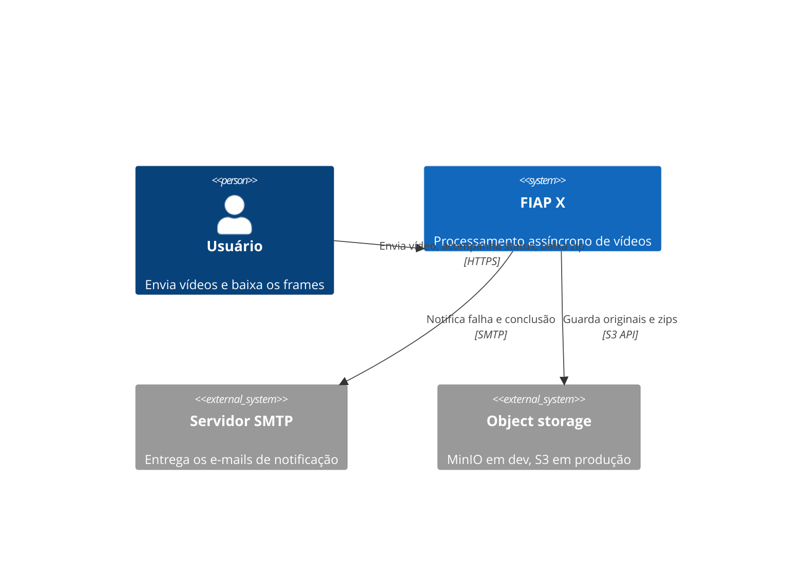
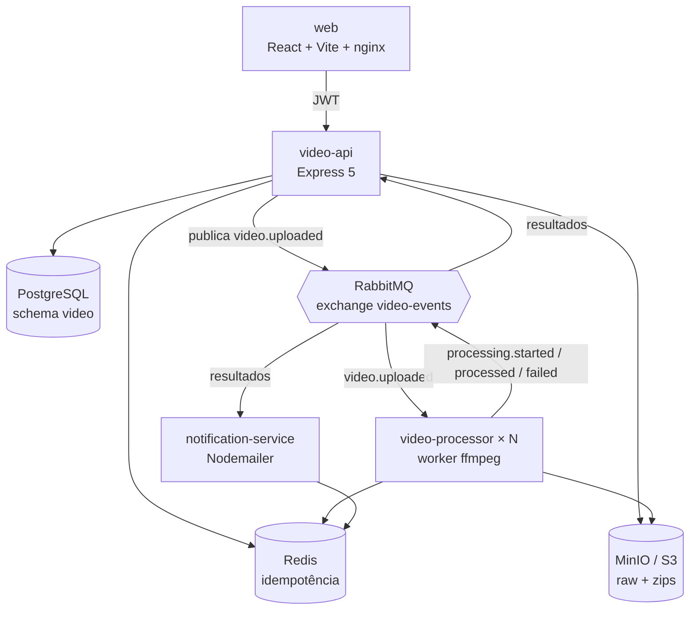
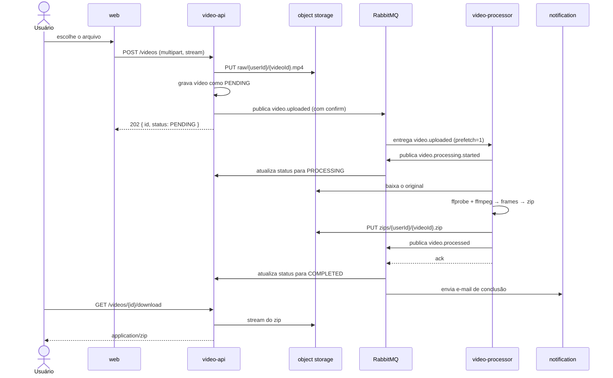
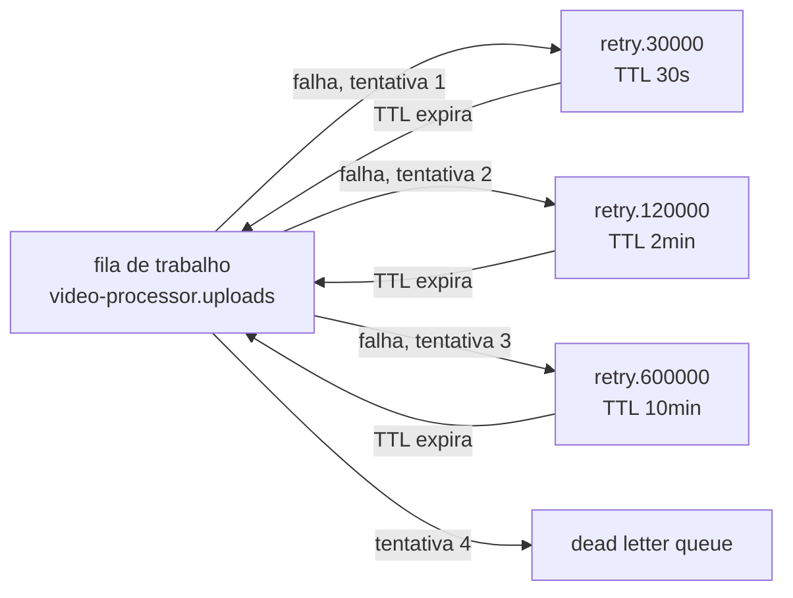
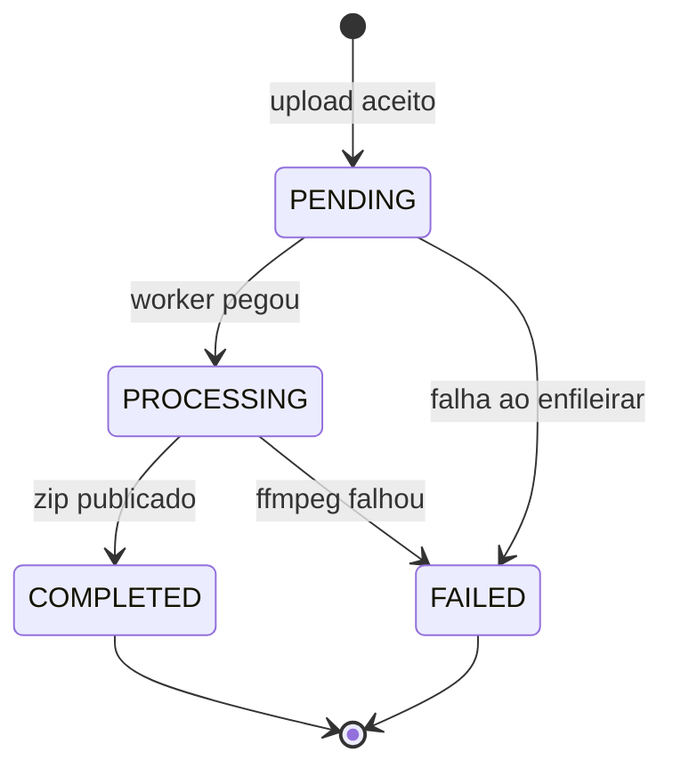
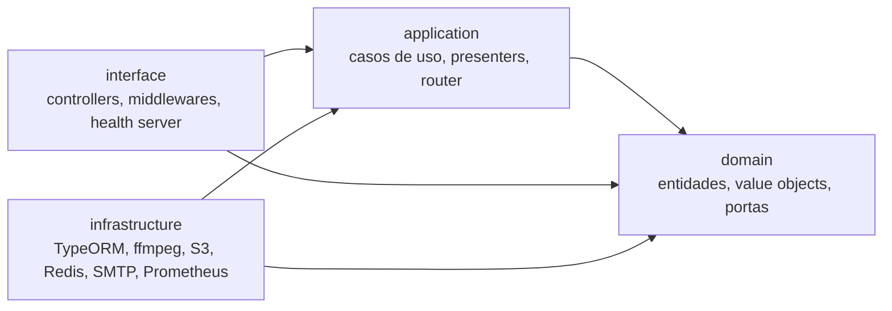

# Arquitetura

## 1. Contexto



## 2. Containers



Cada serviço tem uma responsabilidade única e um dono claro de dados:

| Serviço                | Dono de                     | Estado                                      |
| ---------------------- | --------------------------- | ------------------------------------------- |
| `video-api`            | PostgreSQL (schema `video`) | com estado                                  |
| `video-processor`      | nada                        | **sem estado** — por isso escala livremente |
| `notification-service` | nada                        | sem estado                                  |

Nenhum serviço lê o banco de outro. A comunicação é exclusivamente por eventos, no padrão saga
coreografada: não existe orquestrador central.

## 3. Fluxo de processamento



Quando o processamento falha, o worker publica `video.failed`, a API marca o vídeo como `FAILED`
com o motivo, o `notification-service` envia o e-mail e a mensagem entra na escada de retry.

## 4. Retry e dead letter



O atraso vem do `x-message-ttl` da fila, não de um `setTimeout` na aplicação: a mensagem fica
parada no broker, sem ocupar worker nem memória do processo, e sobrevive a um restart.

## 5. Máquina de estados



Estados terminais não aceitam transição. É isso que torna o sistema imune a eventos fora de ordem:
um `processing.started` que chega depois de um `processed` simplesmente não tem para onde ir, e é
descartado com log em vez de corromper o registro.

## 6. Modelo de dados

```
video.users
  id uuid pk · name · email citext unique · password_hash · created_at

video.videos
  id uuid pk · user_id fk → users · original_name · storage_key · zip_key
  status enum(PENDING, PROCESSING, COMPLETED, FAILED)
  frame_count · duration_ms · size_bytes bigint · frame_interval_seconds
  error_reason · created_at · updated_at

video.video_events
  id uuid pk · video_id fk → videos · type · payload jsonb · created_at
```

Índices: `videos(user_id, created_at DESC)` para a listagem, `videos(status)` para o filtro e
`video_events(video_id, created_at)` para a linha do tempo.

`video_events` é o histórico auditável de tudo que aconteceu com um vídeo — é o que alimenta a
timeline da tela de detalhe.

## 7. Escala

| Componente             | Estratégia                                                                                  |
| ---------------------- | ------------------------------------------------------------------------------------------- |
| `video-api`            | HPA 2→6 réplicas por CPU (70%). Sem estado em memória; a sessão é o JWT                     |
| `video-processor`      | HPA 2→10 réplicas por CPU (65%). `prefetch=1`, então cada réplica é uma unidade de trabalho |
| `notification-service` | 1 réplica basta: envio de e-mail é I/O barato                                               |
| `web`                  | 2 réplicas de nginx atrás do Service                                                        |
| PostgreSQL             | instância única com schema isolado por serviço, como na fase anterior                       |

Como evolução, a documentação de operação registra a troca do HPA por CPU pelo KEDA, escalando o
worker pela profundidade da fila — métrica que corresponde melhor ao trabalho pendente.

## 8. Segurança

- Senhas com bcrypt, custo 12.
- JWT HS256, expiração de 8 horas, segredo apenas em variável de ambiente.
- Login responde a mesma mensagem para e-mail inexistente e senha errada, e compara contra um hash
  fictício quando o usuário não existe, para não permitir enumeração por tempo de resposta.
- Todo acesso a vídeo é escopado por `userId`; recurso de outro usuário responde `404`.
- `helmet` nos cabeçalhos, CORS restrito à origem do frontend.
- Containers rodam como usuário não-root, com filesystem somente leitura e todas as capabilities
  removidas. O worker recebe um `emptyDir` em `/tmp` porque o ffmpeg precisa de disco.
- O nome do arquivo enviado nunca chega a um shell: o ffmpeg é chamado com `spawn` e lista de
  argumentos, jamais com `exec`.
- O motivo da falha e o nome do arquivo são escapados antes de entrar no HTML do e-mail.

## 9. Observabilidade

- Logs JSON via Pino, com `correlationId` que nasce na requisição HTTP e viaja no envelope do
  evento até o e-mail — uma busca por esse id mostra a jornada inteira de um upload.
- Métricas em `/metrics` de cada serviço: `videos_uploaded_total`, `videos_processed_total`,
  `video_processing_failures_total`, `frames_extracted_total` e o histograma
  `video_processing_duration_seconds`, além das métricas padrão de processo.
- Dashboard do Grafana provisionado com vazão, p50/p95 de processamento, latência HTTP por rota e
  número de workers ativos.
- `/health` (liveness) não toca em dependência alguma; `/health/ready` verifica Postgres, RabbitMQ,
  storage e Redis. São probes distintas justamente para que uma dependência lenta não faça o
  Kubernetes matar um processo saudável.

## 10. Camadas internas de cada serviço

Os três serviços de backend seguem a mesma divisão em quatro camadas. A regra de dependência aponta
sempre para dentro: uma seta nunca sai do centro.



`domain` não importa nada de fora — nem do próprio serviço, nem de biblioteca de infraestrutura.
`application` conhece apenas `domain` e as portas que ele declara. Quem instancia adaptador concreto
é só o `container.ts` de cada serviço, o único ponto do código que sabe que o Postgres é Postgres.

A regra é verificada pelo ESLint (`no-restricted-imports` por camada em `.eslintrc.json`), então uma
violação quebra o CI em vez de ficar como convenção escrita.

### Domain — o que é regra de negócio

| Elemento        | Onde        | Invariante que protege                                                                |
| --------------- | ----------- | ------------------------------------------------------------------------------------- |
| `Video`         | `video-api` | Toda mudança de status passa pela máquina de estados; estado terminal não aceita nada |
| `VideoStatus`   | `video-api` | Transições permitidas declaradas em um único mapa                                     |
| `VideoTitle`    | `video-api` | Nome vazio é ausência de nome; limite de 200 caracteres                               |
| `FrameInterval` | `video-api` | Inteiro entre 1 e 3600 segundos                                                       |
| `VideoFormat`   | `video-api` | Somente containers que o ffmpeg do worker processa                                    |
| `User`          | `video-api` | `toPublic()` nunca expõe o hash da senha                                              |

### Portas — o que cada camada exige de fora

| Porta                                                                  | Serviço                | Implementação                |
| ---------------------------------------------------------------------- | ---------------------- | ---------------------------- |
| `VideoRepository`, `UserRepository`                                    | `video-api`            | TypeORM sobre Postgres       |
| `PasswordHasher`, `TokenService`                                       | `video-api`            | bcrypt, jsonwebtoken         |
| `MetricsExporter`, `VideoMetrics`                                      | `video-api`            | `prom-client`                |
| `FrameExtractor`, `ZipArchiver`                                        | `video-processor`      | ffmpeg/ffprobe, archiver     |
| `WorkspaceFactory`                                                     | `video-processor`      | diretório temporário por job |
| `ProcessingMetrics`                                                    | `video-processor`      | `prom-client`                |
| `Mailer`, `NotificationMetrics`                                        | `notification-service` | Nodemailer, `prom-client`    |
| `ObjectStorage`, `IdempotencyStore`, `ProgressStore`, `EventPublisher` | `packages/shared`      | S3/MinIO, Redis, RabbitMQ    |

### SOLID na prática

- **SRP** — `ProcessVideoUseCase` orquestra; baixar, extrair, arquivar e publicar são métodos
  distintos. O controller HTTP não faz parsing de multipart: isso é `multipart-upload.ts`.
- **OCP** — uma nova notificação é um `NotificationHandler` a mais registrado no
  `NotificationRouter`, sem tocar em nenhum handler existente.
- **LSP** — `withProgressFallback` decora um `ProgressStore` e continua sendo um `ProgressStore`.
- **ISP** — as portas descrevem o mínimo que o consumidor usa: `MetricsExporter` tem `contentType` e
  `render()`, não o registry inteiro do Prometheus.
- **DIP** — casos de uso recebem portas pelo construtor; nenhum deles importa um adaptador.
